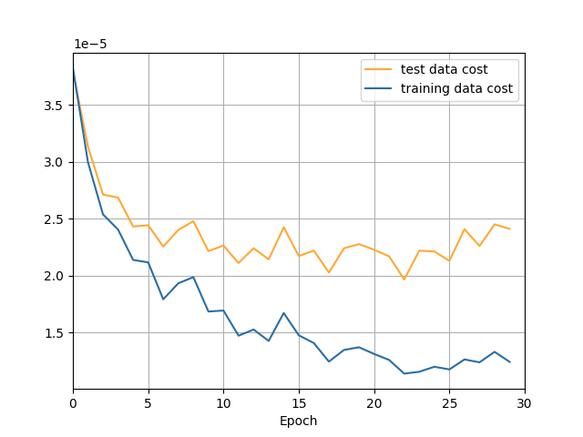

# 实验报告：基于全连接网络的手写数字体识别

* 作者：王佳旭
* 学号：2021213444
* 班级：2021219111
* 学院：人工智能学院

## 文件夹说明

| 文件名           | 内容及作用                       |
| ---------------- | -------------------------------- |
| mnist.pkl.gz     | 手写数字的数据集                 |
| network.py       | 实现识别手写数字的主要代码       |
| execute.py       | 运行一个神经网网络的脚本         |
| figure.py        | 执行小规模训练的绘图代码         |
| mnist_loader.py  | 解压加载mnist数据集的脚本        |
| result.json      | 用于存储的运行后的cost和accuracy |
| model.json       | 保存训练后的模型参数             |
| requirements.txt | 项目依赖的第三方库               |

>  建议查看html版本的实验报告

## 代码实现的主要功能

### 神经网络

 1. 指定神经网络层数以及每层神经网络使用的神经元数量
 2. 每层神经网络的所使用的的激活函数


### 损失函数：

1. 交叉熵损失函数   CrossEntropyCost
1. 均方误差损失函数    QuadraticCost


### 参数初始化：

1. 普通参数初始化  large_weight_initializer
2. 小参数初始化 default_weight_initializer


### 激活函数：

1. sigmoid激活函数及其偏导数
2. softmax激活函数及其偏导数


### 正则化：（正则化被整合入参数更新部分）

1. L2正则化
2. L1正则化


### 数据集分割：
1. test_data：50000
1. validation_data: 10000
1. test_data: 10000

> 使用的数据集由参考书作者提供，作者已经将数据集分为三个部分，且对输入x做了归一化处理
>
> 在excute.py中将evaluation_data = test_data,改为evaludation_data = validation_data就是使用验证集来进行测试
> 同时也可以用来实现对学习率   $\lambda$   和正则化参数   $\eta$   等超参数进行调整


### 参数更新方式：（通过调整mini_batch的大小即可实现三种算法）

1. 普通梯度下降算法
2. 小批量随机梯度下降算法
3. 随机梯度下降


### 绘图：

使用figure.py绘制模型在训练集和测试集的准确率和损失函数随着epoch迭代的图像。

为了保证绘图速度较快，在运行figure.py之后，需要选择训练的样本数量，通常建议1000，这样可以保证训练的速度，快速出图，但是准确率也会下降。

当然，也可以通过导入模型参数，直接对模型进行测试。这需要对figure中的部分代码进行调整。

>  figure中的cost已经对除以了绘图所用的数据，所以较小
>
> 损失函数的图像绘制通常会重叠，因为损失函数量级较大，且图像精度较低


### 模型参数保存与加载：

由save 和 load通过对json文件的操作实现模型参数的存储和加载，同样可以使用test_model单独对模型进行测试


> 以上所有功能，可以通过在execute.py中指定参数，或者在network.py选择性注释掉部分代码实现**参数更新方式**等可选功能的切换


## 运行实例

#### execute.py  关键代码执行后

（784 * 30 * 10的神经网络，每层分别采用sigmoid, sigmoid, softmax激活函数，使用交叉熵损失函数）

（30个epoch，小批量数据集分为10个， 学习率0.5， 正则化参数5.0）

```python
net = network.Network([784, 30, 10], ['sigmoid', 'sigmoid', 'softmax'], cost=network.CrossEntropyCost)
net.large_weight_initializer()  # 比较不好初始化方法，注释掉的话会默认选择方差为1，均值为0，初始权值的正态分布初始化
net.SGD(training_data, 30, 10, 0.5, 5.0, evaluation_data=test_data, monitor_evaluation_accuracy=True)  # 小批量梯度下降法，包含迭代测试结果的输出
net.save('model.json') # 保存模型
```


输出

```
PS C:\Users\85927\Desktop\手写数字识别代码> & D:/anaconda/envs/limu_deepl/python.exe c:/Users/85927/Desktop/手写数字识别代码/execute.py
开始训练，请等待...
****************************************
Epoch 0 训练完成
测试集准确率: 0.9144
****************************************

****************************************
Epoch 1 训练完成
测试集准确率: 0.9282
****************************************

…………（省略部分）

****************************************
Epoch 27 训练完成
测试集准确率: 0.9644
****************************************

****************************************
Epoch 28 训练完成
测试集准确率: 0.9477
****************************************

****************************************
Epoch 29 训练完成
测试集准确率: 0.9608
****************************************
```

（模型参数已经保存进入model.json 中）

#### figure.py在默认参数下执行测试样例后

终端

```
PS C:\Users\85927\Desktop\手写数字识别代码> & D:/anaconda/envs/limu_deepl/python.exe c:/Users/85927/Desktop/手写数字识别代码/figure.py
输入保存结果的文件名称(建议result.json): result.json
输入想要运行的epoch数: 20   
输入训练集的采用的数据规模(建议1000): 1000 
输入正则化参数,lambda(建议5.0): 5.0
****************************************
Epoch 0 训练完成
训练集损失: 1.9727215009866323
训练集准确率: 649 / 1000
测试集损失: 2.276804397074614
测试集准确率: 5575 / 10000
****************************************

****************************************
Epoch 1 训练完成
训练集损失: 1.3040527620294522
训练集准确率: 807 / 1000
测试集损失: 1.671468298844578
测试集准确率: 6975 / 10000
****************************************

…………（中间省略）

****************************************
Epoch 18 训练完成
训练集损失: 0.20076835410959984
训练集准确率: 990 / 1000
测试集损失: 1.2169281585694622
测试集准确率: 8143 / 10000
****************************************

****************************************
Epoch 19 训练完成
训练集损失: 0.19770628582780783
训练集准确率: 991 / 1000
测试集损失: 1.2136953746150674
测试集准确率: 8168 / 10000
****************************************
```
<center class="half">
    
    
</center>


## 实验内容

A1: 基于全链接网络的手写数字体识别 (15 points)

• 本题目考察如何设计并实现一个简单的图像分类器。设置本题目的目的如下：


* 理解基本的图像识别流程及数据驱动的方法（训练、预测等阶段）

*  答：见代码，已完成


* 理解训练集/验证集/测试集的数据划分，以及如何使用验证数据调整模型的超参数

* 答：见代码以及上述对validation_data的作用描述


* 实现一个**全连接神经网络**分类器

* 答：见代码，已实现

  

* 理解不同的分类器之间的区别，以及使用不同的更新方法优化神经网络

* 答：在神经网络中，常用的分类器包括 softmax 分类器和二元分类器。Softmax 分类器适用于多类别分类问题，它会将神经网络的输出转化为概率分布，使用sigmoid作为输出层的神经元同样可行，但是效果不如softmax。

  常用的优化算法包括梯度下降法、随机梯度下降法（SGD）、小批量梯度下降法等。随机梯度下降的优点是计算效率高。缺点是，收敛性相对不稳定由于每次迭代只考虑一个样本，可能会引入一些随机性，使得收敛过程相对不稳定。可能会陷入局部最优解，而不是全局最优解。而小批量梯度下降算法在保留了一定随机性的同时，可以保证参数更新是向着全局最优的方向进行，同时，还可以减轻计算设备的开销。

  学习率是梯度下降算法中一个重要的超参数，它控制了参数更新的步幅。合适的学习率能够加速收敛，但过大的学习率可能会导致震荡甚至发散。正则化方法如 L1 正则化和 L2 正则化可以用于防止过拟合，它们通过对参数进行惩罚来降低模型的复杂度。而正则化参数lambda则是对正则化的一种约束。

  


**• 附加题：** 

 尝试使用不同的损失函数和正则化方法，观察并分析其对实验结果的影响 

答：

#### 两种损失函数的对比（$\lambda$ = 5.0，$\eta$ = 0.5）

**1.**采用784 * 30 * 10的神经网络，每层分别采用sigmoid, sigmoid, softmax激活函数，**使用交叉熵损失函数，L2正则化**

结果如下

<center class="half">
    
    
</center>


**2.**网络同上，**使用均方误差损失函数，L2正则化**

结果如下

<center class="half">
    
    
</center>

通过对比上面面两种不同损失函数的对模型训练效果的对比，发现交叉熵损失函数，cost下降更快，模型准确率更高，且训练速度更快。这样的效果是基于sigmoid和交叉熵损失函数在数学原理上的相适性更好。但是通过图像也可以看出，交叉熵函数的不稳定行大于均方误差函数。


#### 不同正则化方式的对比（$\lambda$ = 5.0，$\eta$ = 0.5）

**1.**采用784 * 30 * 10的神经网络，每层分别采用sigmoid, sigmoid, softmax激活函数，**使用交叉熵损失函数，L2正则化**

结果如下

<center class="half">
    
    
</center>


**2.**采用784 * 30 * 10的神经网络，每层分别采用sigmoid, sigmoid, softmax激活函数，**使用交叉熵损失函数，L1正则化**

结果如下

<center class="half">
    
    
</center>
**3.**采用784 * 30 * 10的神经网络，每层分别采用sigmoid, sigmoid, softmax激活函数，**使用交叉熵损失函数，无正则化**

结果如下

<center class="half">
    
    
</center>

**对比上列三个实验结果，发现，添加了正则化项的模型，过拟合程度显著降低，且准确率有所提高。**


 尝试使用不同的优化算法，观察并分析其对训练过程和实验结果的影响 (如batch GD, online GD, mini-batch GD, SGD, 或其它的优化算法，如Momentum, Adsgrad, Adam, Admax) (+5 points)

**1.** 784 * 30 * 10神经网络（激活函数同上），**使用交叉熵损失函数，L2正则化，小批量随机梯度下降（batch_size = 10), epoch = 30**

结果如下

<center class="half">
    
    
</center>
**2.**网络同上，**使用交叉熵损失函数，L2正则化，普通梯度下降（batch_size = 50000)，epoch = 100(补偿性增大)**

结果如下

<center class="half">
    
    
</center>


**3.** 网络同上，**使用交叉熵损失函数，L2正则化，随机梯度下降（batch_size = 1 ), epoch = 30**

结果如下

<center class="half">
    
    
</center>

根据上述实验结果，发现普通梯度下降算法虽然可以正常更新参数，逐步提高模型准确率，但是每个epoch只更新参数一次，速度非常慢。随机梯度下降，因为每个样例都会导致参数更新，所以随机性会更强，不易控制朝着最优解的方向下降。小批量随机梯度下降法，batch = 10,每个epoch更新5000次参数，在保证了训练速度的同时，提高了模型的稳定性，并且训练效果优于其余两种方法。


## 参考文章、书籍、代码

1. [神经网络之反向传播算法（BP）公式推导（超详细 jsfantasy - 博客园 ](https://www.cnblogs.com/jsfantasy/p/12177275.html)
2. [Neural networks and deep learning](http://neuralnetworksanddeeplearning.com/index.html)
3. [mnielsen/neural-networks-and-deep-learning](https://github.com/mnielsen/neural-networks-and-deep-learning)


## 辅助工具

1. Github copilot  ：VScode插件，辅助编写代码
2. gpt_academic ：通过API部署的本地自用GPT项目，解释上述书籍和仓库中较为难以理解的代码


## 声明

**所有代码均为本人逐行实现，代码机制、公式以及涉及到的数学原理，均理解透彻**